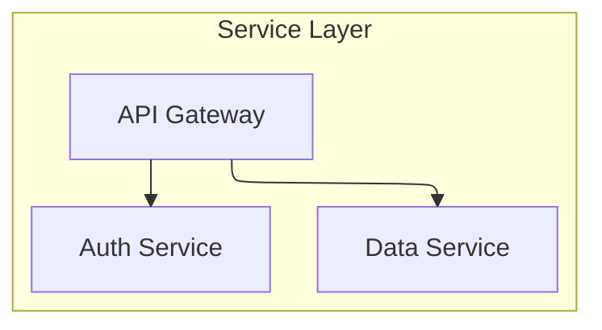

# /sc:markdown-export - Markdown to HTML/PDF Export

## Purpose

Convert Markdown documents to standalone HTML and/or PDF files with full Mermaid diagram support, including ELK layout engine for complex flowcharts.

## Usage

```
/sc:markdown-export <file-or-pattern> [--format=html|pdf|both] [--theme=default|forest|dark|neutral]
```

## Arguments

- `<file-or-pattern>` - Markdown file path or glob pattern (e.g., `docs/*.md`, `**/*.md`)
- `--format` - Output format: `html`, `pdf`, or `both` (default: `both`)
- `--theme` - Mermaid theme (default, forest, dark, neutral)

## Features

- GitHub-flavored Markdown rendering
- Syntax highlighting for code blocks (highlight.js)
- Mermaid diagrams rendered with ELK layout support
- **SVG images embedded inline** in HTML output for self-contained files
- PDF generation via Puppeteer (renders Mermaid before printing)
- Responsive, clean design
- Self-contained output files

## Execution

Run the markdown-export converter:

```bash
node ~/.claude/tools/markdown-export/convert.js "$ARGUMENTS"
```

### First-time setup

If dependencies are not installed:

```bash
cd ~/.claude/tools/markdown-export && npm install
```

## Output Structure

Exports are stored in `export/` folder alongside the source markdown:

```
source-folder/
├── document.md              # Source markdown
└── export/
    ├── html/
    │   └── document.html    # Generated HTML
    └── pdf/
        └── document.pdf     # Generated PDF
```

## Examples

**Single file to both formats:**

```
/sc:markdown-export README.md
```

**HTML only:**

```
/sc:markdown-export docs/design.md --format=html
```

**PDF only with dark theme:**

```
/sc:markdown-export report.md --format=pdf --theme=dark
```

**All docs in a folder:**

```
/sc:markdown-export "docs/**/*.md" --format=both
```

## Mermaid ELK Support

The generated HTML and PDF include the ELK layout engine, enabling advanced diagram layouts:



ELK provides better layout for:

- Complex flowcharts with many nodes
- Subgraphs and nested structures
- Diagrams requiring precise positioning

## PDF Generation

PDF generation uses Puppeteer to:

1. Load the generated HTML in a headless browser
2. Wait for Mermaid diagrams to fully render
3. Print to PDF with proper page sizing

This ensures all diagrams appear correctly in the PDF output.
