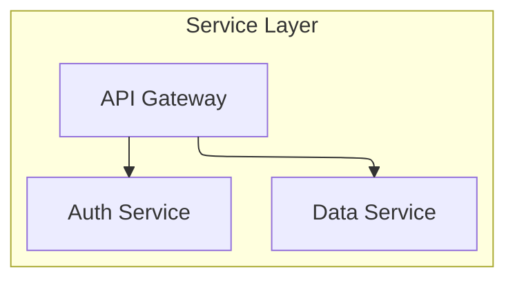

# /sc:markdown-export - Markdown to HTML/PDF Export

## Purpose

Convert Markdown documents to standalone HTML and/or PDF files with full Mermaid diagram support, including ELK layout engine for complex flowcharts.

## Usage

```
/sc:markdown-export <file-or-pattern> [--format=html|pdf|both] [--theme=default|forest|dark|neutral]
```

## Arguments

- `<file-or-pattern>` - Markdown file path or glob pattern (e.g., `docs/*.md`, `**/*.md`)
- `--format` - Output format: `html`, `pdf`, or `both` (default: `both`)
- `--theme` - Mermaid theme (default, forest, dark, neutral)
- `--out=<dir>` - **Consolidated-tree mode.** Emit to `<dir>/{html,pdf}/<source-relative-path>.{html,pdf}` mirroring the source directory tree under `<dir>`. **Use this for any multi-file conversion where cross-doc `[./other.md]` links matter** — without it, each file lands in its own per-directory `export/html/` folder and cross-doc relative links break (the link rewriter only swaps `.md`→`.html`; it cannot fix the doubled `export/html/` indirection across docs). Glob root inferred from the input pattern (longest prefix before the first wildcard) unless `--out-base` overrides.
- `--out-base=<root>` - Source root to strip when computing relative paths under `--out`. Only meaningful with `--out`.

## Features

- GitHub-flavored Markdown rendering
- Syntax highlighting for code blocks (highlight.js)
- Mermaid diagrams rendered with ELK layout support
- **Images embedded inline** as base64 data URIs for self-contained files
- **Content max-width** (`1800px` default) — wide enough for dense tables (e.g. typed-attribute tables in technical docs) on a 27" monitor without horizontal scrolling, while still constraining line length on ultra-wide displays
- **Image max-height** (`700px` default) — diagrams fit on screen without scrolling
- **Pan/zoom viewer** — click any image to open interactive overlay (scroll-zoom, drag-pan, pinch on touch, keyboard shortcuts)
- **Angle bracket escaping** — `<` in mermaid comments auto-escaped to prevent HTML parsing errors
- PDF generation via Puppeteer (renders Mermaid before printing)
- Responsive, clean design
- Self-contained output files

## Image-sizing rule (load-bearing)

**Generate at high native resolution, display at smaller size via CSS, NEVER allow browser upscaling.**

The mermaid renderer (`~/.claude/tools/mermaid-renderer/render-mermaid.js`) generates PNGs at high resolution (viewport `4800×3200`, `deviceScaleFactor: 6`, producing PNGs typically 1920px+ wide). The HTML export's CSS:

```css
:root { --max-width: 1800px; }              /* content column max-width */
img { max-width: 100%; max-height: 700px; height: auto; }
.image-viewer img { max-width: none; max-height: none; }
```

— shrinks the display in the document but leaves the native resolution available. When a user clicks an image, the lightbox viewer opens at native resolution (no upscaling, no quality loss).

**Why this matters**: a small PNG stretched to fill a container produces blur. A large PNG displayed at smaller width via CSS produces a crisp document image AND a high-res asset for click-to-fullscreen. Both effects come for free because the renderer already generates high-res PNGs; the export just needs to constrain display via CSS without ever upscaling.

**Author instruction**: if a markdown document needs a specific display size, use `` rather than relying on default CSS. The HTML export honors the `width` attribute and the lightbox still opens at native resolution.

**Do NOT**: lower the renderer's resolution defaults, force-upscale via CSS, or apply `image-rendering: pixelated`. The current pipeline is optimal — high-res generation + CSS display + lightbox at native = crisp at any zoom level.

## Execution

Run the markdown-export converter:

```bash
node ~/.claude/tools/markdown-export/convert.js "$ARGUMENTS"
```

### First-time setup

If dependencies are not installed:

```bash
cd ~/.claude/tools/markdown-export && npm install
```

## Output Structure

Two layouts depending on whether `--out` is given:

### Default (per-directory) — single files, no cross-doc links

Exports stored in `export/` folder alongside each source markdown:

```
source-folder/
├── document.md              # Source markdown
└── export/
    ├── html/
    │   └── document.html    # Generated HTML
    └── pdf/
        └── document.pdf     # Generated PDF
```

### `--out=<dir>` (consolidated tree) — required for multi-file sets with cross-doc links

The full source tree is mirrored under `<dir>`:

```
docs/manual/                 # source root (inferred from glob, or --out-base=<root>)
├── README.md
├── concept/index.md
└── concept/property/property.md

docs/manual/_export/         # --out=docs/manual/_export
├── html/
│   ├── README.html
│   ├── concept/index.html
│   └── concept/property/property.html
└── pdf/                     # if --format=both|pdf
    └── ...
```

A link in `README.md` to `./concept/index.md` rewrites to `./concept/index.html` and **resolves naturally** because the consolidated tree preserves the source's relative paths. The default per-directory layout cannot do this — its doubled `export/html/` wrapping breaks cross-doc relative links.

## Examples

**Single file to both formats:**

```
/sc:markdown-export README.md
```

**HTML only:**

```
/sc:markdown-export docs/design.md --format=html
```

**PDF only with dark theme:**

```
/sc:markdown-export report.md --format=pdf --theme=dark
```

**All docs in a folder:**

```
/sc:markdown-export "docs/**/*.md" --format=both
```

## Mermaid ELK Support

The generated HTML and PDF include the ELK layout engine, enabling advanced diagram layouts:


```mermaid
%%{init: {"flowchart": {"defaultRenderer": "elk"}} }%%
flowchart TB
    subgraph cluster1[Service Layer]
        A[API Gateway] --> B[Auth Service]
        A --> C[Data Service]
    end
```

ELK provides better layout for:

- Complex flowcharts with many nodes
- Subgraphs and nested structures
- Diagrams requiring precise positioning

## PDF Generation

PDF generation uses Puppeteer to:

1. Load the generated HTML in a headless browser
2. Wait for Mermaid diagrams to fully render
3. Print to PDF with proper page sizing

This ensures all diagrams appear correctly in the PDF output.
