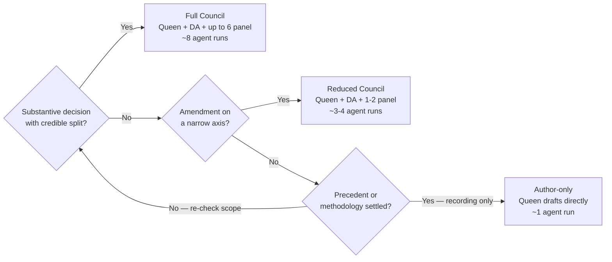

# Panel Roster, Roles & Format Tiers

Reference material for the `council` skill. The normative source is [methodology.md](methodology.md) (§Standing Panel, §Extended Panel, §Roles, §Format tiers); a project's own weighting and pre-elected guests live in its adoption record (template: [adoption-template.md](adoption-template.md)). Use this to pick the *smallest adequate* roster — see "Scoping the roster" below. Do not pad the panel for show.

## Standing Panel (the nine)

Their published positions are stable and domain-agnostic. The roster is fixed; a session names a SUBSET — only the experts whose expertise the questions genuinely touch.

| Expert | Affiliation | Perspective | Reach for when… |
|---|---|---|---|
| Dean Allemang | *Working Ontologist* | Pragmatic RDF modelling, enterprise KG practice | "is this the simplest model that works?"; RDF idiom; reuse-vs-mint |
| Jim Hendler | W3C / RPI | OWL formal semantics, web architecture | OWL entailment correctness; open-world pitfalls; web-architecture fit |
| Elisa Kendall | OMG / EDM Council | Enterprise ontology patterns, FIBO methodology | enterprise-scale precedent; FIBO patterns; class-vs-datum framing (frequent Queen) |
| Kurt Cagle | *The Ontologist* | SHACL practitioner, taxonomy design, AI integration | SHACL-first "structured value not a class" attacks; taxonomy design (frequent DA) |
| Fabien Gandon | W3C / Inria | RDF/RDFS/OWL standards, linked-data principles | standards-conformance; the engineering-act-IS-the-ontological-act side |
| Tom Baker | Dublin Core | Namespace design, metadata standards, vocabulary governance | namespace/URI policy; SKOS scheme stewardship; catalogue hygiene |
| Ian Davis | BBC / UK Gov | Linked-data deployment at scale, government data patterns | publish-first / scope-discipline; deployment realism (frequent DA) |
| Giancarlo Guizzardi | NEMO / UniLu | Conceptual modelling, identity & rigidity, class-vs-value distinctions | whether to mint a class or model a structured value; identity & rigidity of a proposed type |
| Nicola Guarino | ISTC-CNR | Formal ontology theory, identity criteria, ontological well-foundedness | identity criteria; rigidity/dependence; the IC over hard cases |

## Project weighting (per the adoption record)

A project MAY weight specific standing experts more heavily for its domain, declared in its adoption record (§Project Weighting; see [adoption-template.md](adoption-template.md)). Weighting affects DA selection and emphasis; it does NOT change the standing-nine composition of a Full Council. For example, a project whose domain turns on publish-first / scope-discipline framings naturally weights **Davis** up (and reaches for him as DA); one whose domain turns on metadata standards and vocabulary governance weights **Baker** up.

## Extended Panel (domain guests — add only when the question depends on them)

A project MAY **pre-elect** a subset as routinely applicable in its adoption record (§Domain-Extended Panel). The rest are case-by-case.

| Expert | Include for |
|---|---|
| Holger Knublauch (TopQuadrant) | SHACL-specific technical questions (recursion, profile composition, severity tiering) |
| Antoine Isaac / Alistair Miles | SKOS-specific (concept schemes, broader/narrower semantics, mappings) |
| Harshvardhan Pandit | DPV (consent, purpose, lawful basis, PII co-annotation) |
| Renato Iannella | ODRL (policy, data-rights authoring) |
| Luc Moreau | PROV-O provenance modelling |
| Manu Sporny / Drummond Reed | W3C VC / DID / Trust Framework interop |
| Eric Evans / Vaughn Vernon | bounded-context & domain-modelling questions |
| Zhamak Dehghani | data ownership & mesh architecture (multi-stakeholder data) |
| Harith Alani / John Domingue | open-data publishing patterns |
| Ranganathan / ISO 25964 reference | faceted classification or thesaurus questions |

## Roles (named per session)

- **Queen / Moderator** — one expert, named. Frames the questions, sequences deliberation, calls votes, verifies citations, writes the synthesis. The Queen still votes. (Author-only: the convening Queen drafts directly — often "Henrik (convening)" or the natural domain owner.)
- **Devil's Advocate (DA)** — one expert, named. Attacks the proposal: procedural violations, missing constraints, logical gaps, skipped alternatives. Expected to lose votes and to withdraw when persuaded — both recorded. **MUST explicitly withdraw or hold on every contested question** (no silent alignment). A hold is recorded verbatim with a named re-open trigger.
- **Panel** — the remaining named experts, one position each per question.

### DA selection criterion (load-bearing)

The DA's *published methodology* MUST be genuinely opposed to the proposition's framing — not merely orthogonal. A DA whose position aligns produces theatre; one on a different axis produces straw arguments. The strongest DA has *publicly contradicted* a load-bearing premise of the proposition. Typical pairings: **Cagle** (SHACL-first "structured value, not a class") is the natural DA for class-promotion propositions; **Davis** (publish-first / scope-discipline) for "mint it now" propositions; **Guarino/Allemang** when an identity-criterion or simplicity premise is the thing under attack.

## Format tiers — pick the cheapest adequate one

| Tier | When | Apparatus | Cost | Tally appendix? |
|---|---|---|---|---|
| **Author-only** | Recording a decision precedent/methodology has already settled; sequencing/index work; no credible split | Queen drafts the record from existing inputs; no fanned-out positions | ~1 run | No (no panel) |
| **Reduced Council** | Amendment / ratification disputed on a narrow axis (1–2 questions) | Queen + DA + 1–2 panellists on the disputed questions only | ~3–4 runs | Yes |
| **Full Council** | Substantive decision with a credible split spanning multiple expertise clusters | Queen + DA + up to 6 panellists writing positions | ~8 runs | Yes |

The methodology default is Full Council; deviations are justified inline in the convening block. In practice, most sessions are Author-only or Reduced — the directing posture is "cheapest adequate tier", not "default to Full". Over-convening dilutes the methodology (Council theatre).

## Scoping the roster (how to choose WHO, not just how many)

1. **Tier first** (table above) — does the proposition have a credible split (Full), a narrow disputed axis (Reduced), or is it settled (Author-only)?
2. **Then expertise** — for each question, which cluster does it touch? Map questions to experts:
   - Identity / rigidity / class-vs-value distinctions → **Guizzardi + Guarino**.
   - SHACL recursion / shapes / severity → **Knublauch** (+ Cagle if "value not class" is in play).
   - SKOS schemes / broader-narrower / mappings → **Baker + Isaac/Miles**.
   - PROV-O provenance / lifecycle → **Moreau**.
   - DPV / PII / consent → **Pandit**.
   - Namespace / URI / catalogue → **Baker** (+ Gandon for standards conformance).
   - Enterprise precedent / FIBO / class-vs-datum → **Kendall**.
   - Publish-first / scope / deployment realism → **Davis** (often as DA).
   - RDF idiom / simplicity / reuse-vs-mint → **Allemang**.
   - OWL entailment / web architecture → **Hendler / Gandon**.
3. **Drop the rest.** A SHACL-recursion question does not need Hendler; an identity-criterion question does not need Moreau. Padding produces fabricated agreement or abstentions — both are noise. "If a guest expert has nothing distinctive to add over the standing nine, leave them out" (methodology §Extended Panel).
4. **Name the DA by the opposition criterion** above — the genuinely-opposed published position, not a convenient name.
