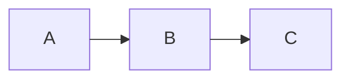
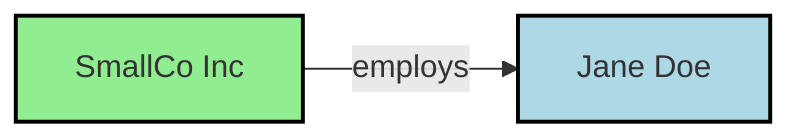

# Mermaid Diagram Documentation

## Inspired by Kurt Cagle's Approach to Visualization

This comprehensive documentation covers Mermaid diagram creation, following the principles and techniques employed by **Kurt Cagle**, a leading expert in linked data, semantic web technologies, and data visualization.

---

## Claude Skill Integration

This documentation suite is optimized for use as a **Claude Code skill**. The skill uses intelligent routing to load only the relevant guide for each diagram type, minimizing token usage while providing comprehensive coverage.

### Skill Entry Point

| File | Purpose |
|------|---------|
| [CLAUDE.md](./CLAUDE.md) | **Skill entry point** - Routing logic, core colors, ELK config, guide loading instructions |

### How the Skill Works

1. **CLAUDE.md** loads first with core philosophy, color palette, and routing logic
2. Based on user request, the skill loads **only the relevant guide**
3. Semantic colors and ELK preferences are always available (inline in CLAUDE.md)
4. Detailed syntax and patterns come from individual guides on-demand

---

## About This Collection

This documentation suite was created to provide:

1. **Kurt Cagle's diagramming philosophy** - How a leading ontologist approaches visualization
2. **Complete diagram type references** - Syntax, examples, and best practices for all types
3. **Color themes and styling** - Including Cagle's semantic color palette
4. **Scenario-based guidance** - Match your use case to the optimal diagram type
5. **LLM-optimized structure** - Guides organized for efficient skill loading

---

## Document Index

### Core Guides

| File | Description |
|------|-------------|
| [00-KURT-CAGLE-STYLE-GUIDE.md](./00-KURT-CAGLE-STYLE-GUIDE.md) | Kurt Cagle's approach to Mermaid diagrams, including his semantic coloring and ELK layout preferences |
| [01-DIAGRAM-TYPES-OVERVIEW.md](./01-DIAGRAM-TYPES-OVERVIEW.md) | Complete catalog of all Mermaid diagram types with quick reference |
| [10-USE-CASE-SCENARIOS.md](./10-USE-CASE-SCENARIOS.md) | Scenario-to-diagram mapping for choosing the right visualization |

### Diagram Type Guides

| File | Description |
|------|-------------|
| [02-FLOWCHART-GUIDE.md](./02-FLOWCHART-GUIDE.md) | Comprehensive flowchart syntax, shapes, styling, and ELK layout |
| [03-SEQUENCE-DIAGRAM-GUIDE.md](./03-SEQUENCE-DIAGRAM-GUIDE.md) | Sequence diagram syntax for API and interaction documentation |
| [04-CLASS-DIAGRAM-GUIDE.md](./04-CLASS-DIAGRAM-GUIDE.md) | Class diagrams for OOP design and code architecture |
| [05-STATE-DIAGRAM-GUIDE.md](./05-STATE-DIAGRAM-GUIDE.md) | State machines and behavioral workflow modeling |
| [06-ER-DIAGRAM-GUIDE.md](./06-ER-DIAGRAM-GUIDE.md) | Entity-relationship diagrams for database design |
| [07-GANTT-GUIDE.md](./07-GANTT-GUIDE.md) | Project planning with Gantt charts |
| [08-OTHER-DIAGRAMS-GUIDE.md](./08-OTHER-DIAGRAMS-GUIDE.md) | Pie, mindmap, journey, timeline, C4, sankey, and more |

### Styling & Color System

| File | Description |
|------|-------------|
| [09-THEMES-AND-STYLING.md](./09-THEMES-AND-STYLING.md) | Complete theming reference including Cagle's color palette |
| [11-CAGLE-COLOR-SYSTEM.md](./11-CAGLE-COLOR-SYSTEM.md) | **Unified color system** based on color theory, WCAG accessibility, and semantic meaning |
| [16-CONFIGURATION-REFERENCE.md](./16-CONFIGURATION-REFERENCE.md) | **Complete configuration options** for all diagram types, ELK layout, and theme variables |

### Architecture & Design Guides

| File | Description |
|------|-------------|
| [12-SOLUTION-ARCHITECTURE-GUIDE.md](./12-SOLUTION-ARCHITECTURE-GUIDE.md) | System context, layered architecture, component diagrams, platform architecture |
| [13-DATA-FLOW-PATTERNS-GUIDE.md](./13-DATA-FLOW-PATTERNS-GUIDE.md) | Async flows, API sequences, event-driven, streaming, batch processing |
| [14-DEPLOYMENT-ARCHITECTURE-GUIDE.md](./14-DEPLOYMENT-ARCHITECTURE-GUIDE.md) | Kubernetes, cloud infrastructure, CI/CD pipelines, container architecture |
| [15-TECHNICAL-DESIGN-PATTERNS-GUIDE.md](./15-TECHNICAL-DESIGN-PATTERNS-GUIDE.md) | Design patterns (creational, structural, behavioral), DDD, API design |

---

## Key Takeaways from Kurt Cagle

### 1. Use ELK Layout for Complex Graphs

ELK (Eclipse Layout Kernel) provides better layout for complex diagrams, especially knowledge graphs with many relationships.

### 2. Prefer Left-to-Right (LR) for Semantic Graphs

This mirrors the Subject-Predicate-Object structure of RDF triples:

### 3. Color-Code by Entity Type

Cagle's semantic color palette:

| Entity Type | Color | Hex |
|-------------|-------|-----|
| Company/Organization | Light Green | `#90EE90` |
| Person/Agent | Light Blue | `#ADD8E6` |
| Literal/Value | Lemon Chiffon | `#FFFACD` |
| Class/Type | Plum | `#DDA0DD` |
| Property | Light Pink | `#FFB6C1` |
| Instance | Khaki | `#F0E68C` |

### 4. Use classDef for Consistent Styling

### 5. The Cagle Color System (WCAG Compliant)

A unified, accessibility-compliant color system based on color theory:

| Semantic Type | Fill | Stroke | Use Case |
|---------------|------|--------|----------|
| **Infrastructure** | `#E3F2FD` | `#1565C0` | Cloud, platforms, networks |
| **Service** | `#E8F5E9` | `#2E7D32` | APIs, microservices |
| **Data** | `#FFF8E1` | `#F57F17` | Databases, storage |
| **User/Actor** | `#F3E5F5` | `#7B1FA2` | People, roles |
| **Process** | `#E1F5FE` | `#0277BD` | Workflows, actions |
| **Security** | `#E0F2F1` | `#00695C` | Auth, encryption |

See [11-CAGLE-COLOR-SYSTEM.md](./11-CAGLE-COLOR-SYSTEM.md) for the complete palette.

### 6. Preserve Namespaces in Comments

---

## Quick Diagram Selection Guide

| Need to Show | Use This | Guide |
|--------------|----------|-------|
| Process/decision flow | Flowchart | [02](./02-FLOWCHART-GUIDE.md) |
| API/service interactions | Sequence Diagram | [03](./03-SEQUENCE-DIAGRAM-GUIDE.md), [13](./13-DATA-FLOW-PATTERNS-GUIDE.md) |
| Database schema | ER Diagram | [06](./06-ER-DIAGRAM-GUIDE.md) |
| Object-oriented design | Class Diagram | [04](./04-CLASS-DIAGRAM-GUIDE.md), [15](./15-TECHNICAL-DESIGN-PATTERNS-GUIDE.md) |
| Design patterns | Class + Sequence | [15](./15-TECHNICAL-DESIGN-PATTERNS-GUIDE.md) |
| Workflow states | State Diagram | [05](./05-STATE-DIAGRAM-GUIDE.md) |
| Project schedule | Gantt Chart | [07](./07-GANTT-GUIDE.md) |
| Data proportions | Pie Chart | [08](./08-OTHER-DIAGRAMS-GUIDE.md) |
| Brainstorming/hierarchy | Mindmap | [08](./08-OTHER-DIAGRAMS-GUIDE.md) |
| User experience | User Journey | [08](./08-OTHER-DIAGRAMS-GUIDE.md) |
| System architecture | C4 + Flowchart | [12](./12-SOLUTION-ARCHITECTURE-GUIDE.md) |
| Cloud infrastructure | Flowchart + ELK | [14](./14-DEPLOYMENT-ARCHITECTURE-GUIDE.md) |
| Kubernetes/containers | Flowchart | [14](./14-DEPLOYMENT-ARCHITECTURE-GUIDE.md) |
| CI/CD pipelines | Flowchart + Sequence | [14](./14-DEPLOYMENT-ARCHITECTURE-GUIDE.md) |
| Data flows/ETL | Sequence + Flowchart | [13](./13-DATA-FLOW-PATTERNS-GUIDE.md) |
| Event-driven systems | Sequence + State | [13](./13-DATA-FLOW-PATTERNS-GUIDE.md) |
| Git branching | GitGraph | [08](./08-OTHER-DIAGRAMS-GUIDE.md) |
| Knowledge graph | Flowchart + ELK (Cagle style) | [00](./00-KURT-CAGLE-STYLE-GUIDE.md) |
| Configuration options | All diagram config | [16](./16-CONFIGURATION-REFERENCE.md) |

---

## Resources

### Kurt Cagle's Publications

- [The Ontologist (Substack)](https://ontologist.substack.com/)
- [The Cagle Report](https://thecaglereport.com/)
- [Kurt Cagle on LinkedIn](https://www.linkedin.com/in/kurtcagle/)
- [RDF, Graphs and Mermaid Diagrams](https://www.linkedin.com/pulse/rdf-graphs-mermaid-diagrams-kurt-cagle-jqrac)
- [Ask Any (Technical) Mermaid](https://kurtcagle.wpcomstaging.com/2023/01/06/ask-any-technical-mermaid/)

### Official Mermaid Resources

- [Mermaid Official Documentation](https://mermaid.js.org/)
- [Mermaid Live Editor](https://mermaid.live/)
- [Mermaid GitHub Repository](https://github.com/mermaid-js/mermaid)
- [Mermaid Chart](https://www.mermaidchart.com/)

---

## Version Information

- **Mermaid Version Reference**: 10.x / 11.x
- **ELK Layout**: Available from Mermaid 9.4+
- **Documentation Created**: December 2025

---

## Contributing

This documentation is designed to be a living resource. To extend:

1. Add new diagram examples to appropriate guide files
2. Update use case scenarios as new diagram types emerge
3. Document additional styling techniques and themes
4. Share knowledge graph visualization patterns

---

*"Mermaid is quietly entering into tool chains in the data architecture and semantic stacks, including in commercial products, and is becoming an integral part of tools such as Atlassian Confluence, GitHub, and WordPress."*

— Kurt Cagle
