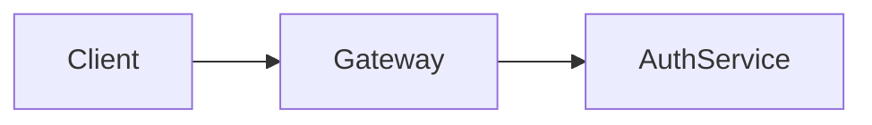

# Diagramming Skill

Generate professional diagrams with semantic coloring (Cagle palette) and accessibility compliance.

## CRITICAL: Always Use Mermaid/DOT Over ASCII Art

**NEVER use ASCII art for diagrams.** When you encounter ASCII art diagrams in existing documents or when you need to create any visual representation:

1. **Replace existing ASCII diagrams** with Mermaid or DOT equivalents
2. **Create new diagrams** using Mermaid or DOT, never ASCII
3. **Convert on sight** - if you see ASCII art representing a flow, architecture, sequence, or any visual concept, convert it to a proper diagram

ASCII art is:
- Not accessible (screen readers can't interpret it)
- Not maintainable (hard to modify)
- Not portable (breaks with font changes)
- Not professional (looks dated)

Mermaid/DOT diagrams are:
- Accessible (with `accTitle`/`accDescr`)
- Maintainable (text-based, version-controllable)
- Renderable (to PNG/SVG for documentation)
- Professional (clean, consistent styling)

---

## Tool Selection

| Use Case | Tool | Reason |
|----------|------|--------|
| Flowcharts, sequences, ER, Gantt | **Mermaid** | Structured labeled relationships, markdown embedding |
| Pure network graphs, semantic webs | **DOT/Graphviz** | Community standard, maximum layout control |
| SHACL shapes, RDF with constraints | **Mermaid** | Dashed strokes, subgraphs for named graphs |
| Ball-and-arrow graphs, large networks | **DOT/Graphviz** | Native graph notation, better edge routing |
| Documentation, web embedding | **Mermaid** | GitHub/GitLab rendering, web-native |

**Default**: Start with Mermaid. Switch to DOT when pure network topology is primary concern.

---

## Diagram Type Router

Load **only ONE guide** per request. Match user intent to the most specific keywords:

| User Intent | Load Guide | Output Format |
|-------------|------------|---------------|
| Process, flow, decision tree, algorithm | 02-FLOWCHART-GUIDE.md | Mermaid `flowchart` |
| API calls, service interaction, request/response | 03-SEQUENCE-DIAGRAM-GUIDE.md | Mermaid `sequenceDiagram` |
| OOP, classes, interfaces, inheritance | 04-CLASS-DIAGRAM-GUIDE.md | Mermaid `classDiagram` |
| State machine, workflow states, lifecycle | 05-STATE-DIAGRAM-GUIDE.md | Mermaid `stateDiagram-v2` |
| Database schema, data model, entities | 06-ER-DIAGRAM-GUIDE.md | Mermaid `erDiagram` |
| Project timeline, schedule, milestones | 07-GANTT-GUIDE.md | Mermaid `gantt` |
| Pie, mindmap, journey, timeline, git, C4, sankey, XY | 08-OTHER-DIAGRAMS-GUIDE.md | Mermaid various |
| Styling, themes, colors, accessibility | 09-STYLING-GUIDE.md | n/a |
| "What diagram should I use?" | 10-USE-CASE-SCENARIOS.md | n/a |
| System architecture, platform design | 12-SOLUTION-ARCHITECTURE-GUIDE.md | Mermaid `flowchart` |
| Data flow, async, events, streaming | 13-DATA-FLOW-PATTERNS-GUIDE.md | Mermaid various |
| Kubernetes, cloud, CI/CD, deployment | 14-DEPLOYMENT-ARCHITECTURE-GUIDE.md | Mermaid `flowchart` |
| Design patterns, DDD, API design | 15-TECHNICAL-DESIGN-PATTERNS-GUIDE.md | Mermaid various |
| Configuration options, all settings | 16-CONFIGURATION-REFERENCE.md | n/a |
| RDF, ontology, SHACL, triples, linked data, SPARQL | 17-LINKED-DATA-GUIDE.md | Mermaid `flowchart LR` + ELK |
| Property graph, Neo4j, Cypher, graph database | 18-PROPERTY-GRAPH-GUIDE.md | Mermaid `flowchart` + ELK |
| **Pure network graph, semantic graph, Turtle→DOT** | **19-DOT-GRAPHVIZ-GUIDE.md** | **DOT/Graphviz** |

### Decision Logic (Specificity Order)

Match **most specific first**. Check in this order:

| Priority | Keywords | Guide | Format |
|----------|----------|-------|--------|
| 1 | DOT, Graphviz, digraph, Turtle→graph, "pure network" | 19-DOT-GRAPHVIZ-GUIDE.md | DOT |
| 2 | RDF, ontology, SHACL, triple, linked data, SPARQL | 17-LINKED-DATA-GUIDE.md | Mermaid |
| 3 | Neo4j, Cypher, property graph, graph database | 18-PROPERTY-GRAPH-GUIDE.md | Mermaid |
| 4 | pie chart, mindmap, journey map, C4, sankey, quadrant, gitGraph | 08-OTHER-DIAGRAMS-GUIDE.md | Mermaid |
| 5 | kubernetes, docker, container, CI/CD, pipeline, helm | 14-DEPLOYMENT-ARCHITECTURE-GUIDE.md | Mermaid |
| 6 | microservice, system architecture, platform design | 12-SOLUTION-ARCHITECTURE-GUIDE.md | Mermaid |
| 7 | async, event-driven, pub/sub, streaming, message queue | 13-DATA-FLOW-PATTERNS-GUIDE.md | Mermaid |
| 8 | design pattern, DDD, domain model, factory, singleton | 15-TECHNICAL-DESIGN-PATTERNS-GUIDE.md | Mermaid |
| 9 | database, schema, entity, table, ERD | 06-ER-DIAGRAM-GUIDE.md | Mermaid |
| 10 | API, request/response, service call, HTTP | 03-SEQUENCE-DIAGRAM-GUIDE.md | Mermaid |
| 11 | state machine, lifecycle, status, workflow state | 05-STATE-DIAGRAM-GUIDE.md | Mermaid |
| 12 | class, interface, inheritance, OOP, UML class | 04-CLASS-DIAGRAM-GUIDE.md | Mermaid |
| 13 | project schedule, gantt, milestone, timeline (project) | 07-GANTT-GUIDE.md | Mermaid |
| 14 | timeline (chronology), history, evolution | 08-OTHER-DIAGRAMS-GUIDE.md | Mermaid |
| 15 | theme, styling, colors, classDef, WCAG, accessibility, Cagle palette | 09-STYLING-GUIDE.md | Mermaid |
| 16 | configuration, settings, ELK options, layout, spacing | 16-CONFIGURATION-REFERENCE.md | Mermaid |
| 17 | flowchart, process, decision tree, algorithm | 02-FLOWCHART-GUIDE.md | Mermaid |
| 18 | "what diagram should I use", help choosing | 10-USE-CASE-SCENARIOS.md | n/a |

**Default**: If unclear, ask user to clarify or suggest options from 10-USE-CASE-SCENARIOS.md.

---

## Essential Configuration (Always Available)

### ELK Layout (Use for Complex Diagrams)

```yaml
---
config:
  layout: elk
  elk:
    mergeEdges: false
    nodePlacementStrategy: BRANDES_KOEPF
---
```

**When to use ELK**: >10 nodes, dense connections, knowledge graphs, complex architectures

### Theme Configuration (Base Theme Required)

```yaml
%%{init: {
  "theme": "base",
  "themeVariables": {
    "primaryColor": "#E3F2FD",
    "primaryTextColor": "#0D47A1",
    "primaryBorderColor": "#1565C0",
    "lineColor": "#37474F"
  }
}}%%
```

**CRITICAL**: Only `base` theme supports customization. Only hex colors work.

---

## Cagle Color Palette (Memorize)

### Architecture Colors

| Type | Fill | Stroke | Use |
|------|------|--------|-----|
| **Infrastructure** | `#E3F2FD` | `#1565C0` | Cloud, platforms, networks |
| **Service** | `#E8F5E9` | `#2E7D32` | APIs, microservices |
| **Data** | `#FFF8E1` | `#F57F17` | Databases, storage |
| **User/Actor** | `#F3E5F5` | `#7B1FA2` | People, roles |
| **Process** | `#E1F5FE` | `#0277BD` | Workflows, actions |
| **Security** | `#E0F2F1` | `#00695C` | Auth, encryption |
| **External** | `#ECEFF1` | `#455A64` | Third-party systems |

### Status Colors

| Status | Fill | Stroke |
|--------|------|--------|
| **Success** | `#C8E6C9` | `#2E7D32` |
| **Warning** | `#FFF9C4` | `#F9A825` |
| **Error** | `#FFCDD2` | `#C62828` |
| **Info** | `#BBDEFB` | `#1565C0` |

### Knowledge Graph Colors (Semantic)

| Entity | Fill | Stroke |
|--------|------|--------|
| **Class/Type** | `#E1BEE7` | `#6A1B9A` |
| **Instance** | `#B3E5FC` | `#0277BD` |
| **Property** | `#F8BBD9` | `#AD1457` |
| **Literal** | `#FFF9C4` | `#F57F17` |

### classDef Template (Copy-Paste Ready)

```
classDef infra fill:#E3F2FD,stroke:#1565C0,stroke-width:2px,color:#0D47A1
classDef service fill:#E8F5E9,stroke:#2E7D32,stroke-width:2px,color:#1B5E20
classDef data fill:#FFF8E1,stroke:#F57F17,stroke-width:2px,color:#E65100
classDef user fill:#F3E5F5,stroke:#7B1FA2,stroke-width:2px,color:#4A148C
classDef process fill:#E1F5FE,stroke:#0277BD,stroke-width:2px,color:#01579B
classDef security fill:#E0F2F1,stroke:#00695C,stroke-width:2px,color:#004D40
classDef external fill:#ECEFF1,stroke:#455A64,stroke-width:2px,color:#263238
classDef success fill:#C8E6C9,stroke:#2E7D32,stroke-width:2px,color:#1B5E20
classDef warning fill:#FFF9C4,stroke:#F9A825,stroke-width:2px,color:#F57F17
classDef error fill:#FFCDD2,stroke:#C62828,stroke-width:2px,color:#B71C1C
```

---

## Output Format

When generating diagrams, always:

1. **Use backticks (``` ) not tildes (~~~)** for code fences - required for renderer compatibility
2. **Start with configuration** if using ELK or custom theme
3. **Declare classDef** styles before using them
4. **Use semantic colors** based on entity type
5. **Add comments** for complex diagrams explaining structure
6. **Include the complete diagram** - never truncate

**CRITICAL**: Always use triple backticks (` ``` `) for mermaid/dot code blocks, never triple tildes (`~~~`). Renderers and export tools require backtick fences.

### Document Structure (After Export)

After exporting diagrams to PNG, the document should have:
1. The rendered PNG image (using `` tag for size control)
2. A collapsible `<details>` block containing the mermaid source

**CRITICAL**: For image sizing, MUST use `` tag with width attribute. NEVER use CSS.

**NOTE**: Diagrams export to **PNG by default** for maximum compatibility with markdown previews (VS Code, GitHub, Zed). Use `--format=svg` only when SVG is specifically needed.

```markdown


<details>
<summary>Mermaid Source</summary>

` ``mermaid
flowchart LR
    A --> B
` ``

</details>
```

**Size Guidelines:**
| Diagram Type | Recommended Width |
|--------------|-------------------|
| Simple flowcharts | `width="70%"` |
| Complex architectures | `width="90%"` |
| Sequence diagrams | `width="80%"` |
| State machines | `width="60%"` |
| ER diagrams | `width="85%"` |

This preserves the source for future editing while keeping the document clean.

### Standard Output Structure

```mermaid
---
config:
  layout: elk  # Only if needed
---
%%{init: {"theme": "base", "themeVariables": {...}}}%%
diagramType
    accTitle: Brief diagram title for screen readers
    accDescr: One-line description of what the diagram shows

    %% Style definitions
    classDef type1 fill:...,stroke:...

    %% Diagram content
    Node1[Label]:::type1
    Node1 --> Node2
```

### Accessibility Directives

Always include accessibility metadata for screen readers:



---

## MANDATORY: Line Breaks — ALWAYS `<br/>`, NEVER `\n`

Mermaid does NOT interpret `\n` as a line break. It renders as the **literal characters** `\n` in the output. This applies everywhere: node labels, edge labels, subgraph titles, and any quoted string.

**ALWAYS** use `<br/>`. **NEVER** use `\n`. No exceptions.

```
WRONG:  A["First line\nSecond line"]         → shows literal \n
WRONG:  A -->|"line one\nline two"| B        → shows literal \n
CORRECT: A["First line<br/>Second line"]      → actual line break
CORRECT: A -->|"line one<br/>line two"| B     → actual line break
```

**Before writing ANY mermaid code**, mentally replace every `\n` with `<br/>`. After writing, search the block for `\n` — if found in any label or string, replace it.

---

## MANDATORY: Reserved Keywords — Never Use as classDef Names

Mermaid reserves these keywords. Using them as `classDef` names causes **silent parse failures** (diagram renders as "Syntax error in text" with no useful message):

| Reserved Word | What It Does | Use Instead |
|---------------|-------------|-------------|
| `class` | Applies styles to nodes | `cls`, `rdfClass`, `ontClass` |
| `graph` | Declares diagram type | `graphNode`, `namedGraph` |
| `subgraph` | Opens a group | `subGroup`, `cluster` |
| `end` | Closes a group | `endNode`, `terminal` |
| `default` | Default style | `defaultStyle`, `base` |
| `direction` | Sets flow direction | `dir`, `flowDir` |
| `style` | Inline styles | `styleNode`, `styled` |
| `click` | Click events | `clickable`, `interactive` |
| `linkStyle` | Edge styling | `edgeStyle`, `linkFmt` |

```
WRONG:  classDef class fill:#E1BEE7,stroke:#6A1B9A
WRONG:  classDef graph fill:#FFF9C4,stroke:#F9A825
CORRECT: classDef cls fill:#E1BEE7,stroke:#6A1B9A
CORRECT: classDef namedGraph fill:#FFF9C4,stroke:#F9A825
```

---

## Validation Gate (MANDATORY before export)

After creating or modifying mermaid diagrams in a document, **ALWAYS validate** before rendering:

```bash
bash ~/.claude/tools/mermaid-renderer/validate-diagrams.sh <document-path>
```

This runs every mermaid block through the mermaid parser and reports OK/FAIL with error details. **Do not render or export until all blocks pass.**

If a block fails:
1. Read the error message — it shows the line number and unexpected token
2. Common causes: reserved keyword as classDef name, unescaped special characters, malformed YAML frontmatter
3. Fix and re-validate

---

## MANDATORY: Common Errors — Avoid These

These are the most frequently encountered mermaid errors. Each causes silent rendering failure ("Syntax error in text"):

### 1. Angle brackets in comments parsed as HTML

When mermaid code is embedded in `<pre class="mermaid">` for rendering, angle brackets in comments like `%% @prefix ex: <http://example.org/>` are parsed as HTML tags, destroying the mermaid source before the parser sees it.

**The renderer handles this automatically**, but be aware:
- `<br/>`, `<b>`, `<i>` in labels are safe (explicitly preserved)
- All other `<` characters in comments are escaped automatically
- If rendering fails silently, check for unescaped `<` in comments

### 2. `\n` in labels (renders as literal text)

See the **MANDATORY: Line Breaks** section above.

### 3. Reserved words as `classDef` names

See the **MANDATORY: Reserved Keywords** section above.

### 4. Unescaped HTML special characters in labels

`<`, `>`, `&` in node labels are interpreted as HTML:
```
WRONG:  A["Latency <15min"]       → <15min parsed as HTML tag
CORRECT: A["Latency &lt;15min"]   → renders correctly
CORRECT: A["Latency under 15min"] → avoid the issue entirely
```

### 5. Unquoted labels with special characters

Labels containing `(`, `)`, `[`, `]`, `{`, `}`, `#`, `&`, or `:` must be quoted:
```
WRONG:  A[Count: 42]       → colon breaks the parser
CORRECT: A["Count: 42"]    → quoted label is safe
```

### 6. Missing diagram type declaration

Every mermaid block must start with a diagram type (or YAML frontmatter followed by a diagram type):
```
WRONG:  A --> B             → no diagram type
CORRECT: flowchart LR       → diagram type declared
            A --> B
```

### 7. Subgraph `end` keyword conflicts

The word `end` closes subgraphs. Never use it as a node ID:
```
WRONG:  end[End State]       → conflicts with subgraph end
CORRECT: endState[End State]  → safe
```

---

## Quality Checklist

Before returning any diagram:

- [ ] Correct diagram type for the use case?
- [ ] ELK enabled if >10 nodes or complex relationships?
- [ ] Semantic colors applied consistently?
- [ ] All nodes labeled clearly (≤30 characters for readability)?
- [ ] **Line breaks use `<br/>` not `\n`?** (search the block!)
- [ ] **No reserved words as classDef names?** (`class`, `graph`, `end`, `default`, etc.)
- [ ] Relationships have meaningful labels where needed?
- [ ] Configuration block properly formatted?
- [ ] No syntax errors — **run validation gate**?
- [ ] Accessibility: `accTitle` and `accDescr` included?

---

## Loading Secondary Guides

When you need detailed syntax or patterns beyond this entry point:

1. **Match user request** to the Decision Logic table above
2. **Use the Read tool** to load the guide from the same directory as this SKILL.md file
3. **Apply patterns** from the guide to user's specific need
4. **Use Cagle colors** from this file (always available)

**Load only ONE guide per request** to minimize context usage.

---

## Example Interactions

### User: "Create a database schema for a blog"
**Action**: Load 06-ER-DIAGRAM-GUIDE.md, generate erDiagram with USER, POST, COMMENT, TAG entities

### User: "Show me how a REST API request flows"
**Action**: Load 03-SEQUENCE-DIAGRAM-GUIDE.md, generate sequenceDiagram with Client, Gateway, Service, Database

### User: "Architecture diagram for a microservices platform"
**Action**: Load 12-SOLUTION-ARCHITECTURE-GUIDE.md, generate flowchart with ELK, using service/data/infra colors

### User: "What diagram should I use for showing order states?"
**Action**: Recommend State Diagram, load 05-STATE-DIAGRAM-GUIDE.md

### User: "I need to show project milestones"
**Action**: Load 07-GANTT-GUIDE.md, generate gantt with milestones

### User: "Visualize this RDF ontology"
**Action**: Load 17-LINKED-DATA-GUIDE.md, generate flowchart LR with ELK, class/instance/literal colors

### User: "Show a Neo4j social network model"
**Action**: Load 18-PROPERTY-GRAPH-GUIDE.md, generate flowchart with labeled relationships (:KNOWS, :FOLLOWS)

### User: "Generate a DOT graph from this Turtle data"
**Action**: Load 19-DOT-GRAPHVIZ-GUIDE.md, generate DOT digraph with semantic colors

### User: "I need a pure network graph visualization"
**Action**: Load 19-DOT-GRAPHVIZ-GUIDE.md, generate DOT with layout attributes

---

## Default Behaviors

- **ELK layout**: Enable for >10 nodes or dense connections
- **LR direction**: Use for semantic/knowledge graphs (S-P-O structure)
- **Semantic colors**: Apply consistently from Cagle palette above
- **Accessibility**: Always include `accTitle` and `accDescr`
- **Namespaces**: Document as comments (`%% @prefix ex: <...>`)
- **Ambiguity**: Ask user to clarify rather than guess

---

## Post-Creation Export Workflow (MANDATORY)

**CRITICAL**: After creating or editing ANY mermaid/DOT diagram in a markdown document, you MUST run the export command to render the diagram to an image. This is NOT optional.

### Automatic Export Rule

**ALWAYS run the export command immediately after:**

- Adding a new mermaid or DOT code block to a document
- Modifying an existing diagram in a document
- Replacing ASCII art with a mermaid/DOT diagram

**DO NOT** leave mermaid code blocks unrendered in documents. The final document must contain:

1. The rendered image (PNG/SVG)
2. The source code in a collapsible `<details>` block

### Export Commands

**For Mermaid diagrams** (` ```mermaid ` blocks):

```bash
node ~/.claude/tools/mermaid-renderer/process-document.js <document-path> --verbose
```

**For DOT/Graphviz diagrams** (` ```dot `, ` ```graphviz `, ` ```gv ` blocks):

```bash
node ~/.claude/tools/dot-renderer/process-document.js <document-path> --verbose
```

### Result Structure

```
document.md
diagrams/
└── document/
    ├── diagram-1.png
    ├── architecture-overview.png
    └── data-flow.png
```

### What Export Does

1. **Extracts** all diagram code blocks from the document
2. **Renders** each to PNG in `diagrams/{document-name}/`
3. **Replaces** code blocks with image references: ``
4. **Preserves** original code in `<details>` block for future editing

### Post-Export Document Format

```markdown
<!-- Before -->
` ``mermaid
flowchart LR
    A --> B
` ``

<!-- After (use  tag for sizing, NEVER CSS) -->


<details>
<summary>Mermaid Source</summary>

` ``mermaid
flowchart LR
    A --> B
` ``

</details>
```

### Re-editing Workflow

1. Find the `<details>` block containing the mermaid source
2. Copy the mermaid code block above the image reference
3. Edit the diagram
4. Re-run the export command
5. New SVG replaces the old one, `<details>` block is updated
