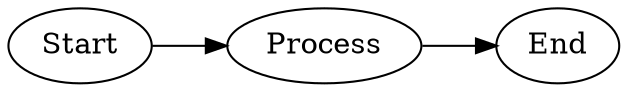
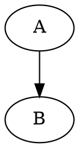
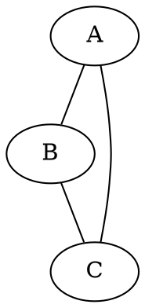
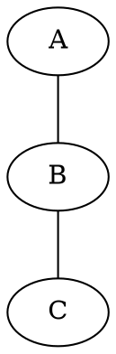
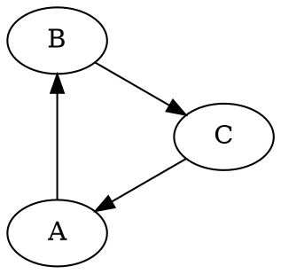
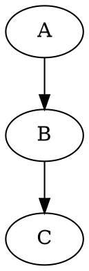
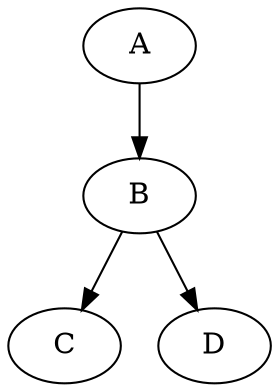
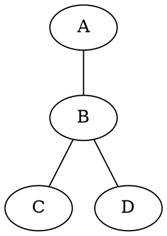
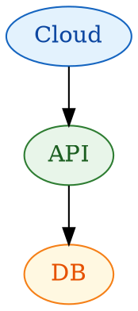
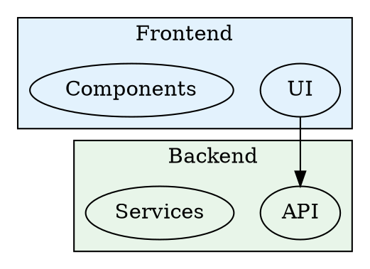

# DOT/Graphviz Diagram Export Skill

Automatically render DOT/Graphviz diagrams in documents to PNG images (default) using the dot-renderer tool. Use `--format=svg` for scalable vector output.

---

## Tool Location

```
~/.claude/tools/dot-renderer/
├── render-dot.js         # Single diagram renderer
└── process-document.js   # Full document processor
```

---

## Workflow

### Step 1: Create Document with DOT Diagrams

When creating a document with DOT diagrams, use the standard DOT syntax in code blocks:

```markdown
# My Document

Here's the graph:



More content...
```

### Step 2: Export Diagrams to PNG

After creating/editing a document with DOT blocks, run:

```bash
node ~/.claude/tools/dot-renderer/process-document.js <document-path> --verbose
```

**Options:**
- `--format=<fmt>` - Output format: `png` (default) or `svg`
- `--layout=<engine>` - Force layout engine for all diagrams: `dot`, `neato`, `circo`, `fdp`, `twopi`, `osage`, `patchwork`
- `--verbose` - Show detailed progress
- `--dry-run` - Preview without making changes

**NOTE**: PNG is the default format for maximum compatibility with markdown previewers. Use `--format=svg` when scalable vector output is needed.

### Step 3: Result Structure

The tool will:
1. **Extract** all DOT code blocks (`\`\`\`dot`, `\`\`\`graphviz`, or `\`\`\`gv`)
2. **Render** each to SVG in `diagrams/{document-name}/`
3. **Replace** the code block with an image reference
4. **Preserve** original code in a comment for future editing

**Output structure:**
```
document.md
diagrams/
└── document/
    ├── diagram-1.png
    ├── network-topology.png
    └── class-hierarchy.png
```

**Document transformation:**
```markdown
<!-- Before -->


<!-- After -->


<!--
Original DOT diagram (uncomment to edit, then re-render):

-->
```

---

## Layout Engines

Choose the appropriate layout engine for your graph type:

| Engine | Best For | Description |
|--------|----------|-------------|
| `dot` | Hierarchical graphs | Directed graphs, org charts, flowcharts (default) |
| `neato` | Undirected graphs | Network diagrams, social networks |
| `fdp` | Large graphs | Force-directed placement, clusters |
| `circo` | Circular layouts | Ring structures, cyclic dependencies |
| `twopi` | Radial layouts | Tree-like structures radiating from center |
| `osage` | Clustered layouts | Nested clusters, module diagrams |
| `patchwork` | Treemaps | Space-filling rectangular layout |

### Specifying Layout

Three ways to specify layout engine:

**1. In the code fence:**
```markdown

```

**2. In the DOT code (comment):**


**3. In the DOT code (attribute):**


**4. CLI override (applies to all diagrams):**
```bash
node ~/.claude/tools/dot-renderer/process-document.js doc.md --layout=neato
```

---

## Rendering Single Diagrams

To render a single diagram without processing a full document:

```bash
# From a .dot file
node ~/.claude/tools/dot-renderer/render-dot.js diagram.dot output.svg

# From stdin
echo "digraph { A -> B }" | node ~/.claude/tools/dot-renderer/render-dot.js --stdin output.svg

# With specific layout
node ~/.claude/tools/dot-renderer/render-dot.js diagram.dot output.svg --layout=neato

# Other output formats
node ~/.claude/tools/dot-renderer/render-dot.js diagram.dot output.json --format=json
```

---

## Supported Document Types

| Extension | Image Syntax Used |
|-----------|-------------------|
| `.md`, `.markdown` | `` with HTML comment |
| `.html`, `.htm` | `` tag with HTML comment |
| `.mdx` | JSX `` with JSX comment |
| `.rst` | `.. image::` directive |
| `.adoc` | `image::` macro |

---

## Supported Code Fence Syntax

All these are equivalent:
- `\`\`\`dot` - Standard DOT
- `\`\`\`graphviz` - Full name alias
- `\`\`\`gv` - Short alias

With layout hint:
- `\`\`\`dot:neato`
- `\`\`\`graphviz:circo`
- `\`\`\`gv:fdp`

---

## Integration with Diagramming Skill

This skill works together with the diagramming skill:

1. **Design**: Use the diagramming skill with 19-DOT-GRAPHVIZ-GUIDE.md for DOT syntax and semantic coloring
2. **Export**: Use this skill to render diagrams to SVG for distribution

**Recommended workflow:**
1. Create document with DOT code blocks (using diagramming skill for styling)
2. Review diagrams in a tool like Graphviz Online or VS Code extension
3. Run export to generate final SVGs
4. Commit both document and generated SVGs

---

## Diagram Naming

Diagrams are named based on:
1. **Graph name** in DOT syntax: `digraph MyGraph {` → `mygraph.svg`
2. **Label attribute**: `label="Network Topology"` → `network-topology.svg`
3. **Fallback**: `diagram-1`, `diagram-2`, etc.

To control naming, use a named graph:

→ Generates `networktopology.svg`

---

## Editing Rendered Diagrams

To edit a previously rendered diagram:
1. Find the commented original code in the document
2. Uncomment the DOT block
3. Edit the diagram
4. Re-run the export tool
5. The new SVG will replace the old one

---

## Output Formats

The renderer supports multiple output formats:

| Format | Extension | Use Case |
|--------|-----------|----------|
| `svg` | `.svg` | Web, documents, scalable (default) |
| `dot` | `.dot` | Canonical DOT output |
| `json` | `.json` | Graph structure as JSON |
| `dot_json` | `.json` | DOT with JSON output |
| `xdot_json` | `.json` | Extended DOT with JSON |

---

## Troubleshooting

### "Cannot find module 'node-graphviz'"
Install dependencies: `cd ~/.claude/tools/dot-renderer && npm install`

### Diagram doesn't render
- Check DOT syntax at https://dreampuf.github.io/GraphvizOnline/
- Ensure graph type matches layout (use `graph` for undirected with neato, `digraph` for directed)

### Layout looks wrong
- Try different layout engines
- For undirected graphs, use `neato` or `fdp`
- For hierarchical data, use `dot`
- For circular, use `circo` or `twopi`

### SVG too large/small
The tool auto-sizes based on diagram content. For custom sizing, edit the generated SVG or use CSS in your document.

---

## Example Commands

```bash
# Process a markdown file
node ~/.claude/tools/dot-renderer/process-document.js ./docs/README.md --verbose

# Process with specific layout for all diagrams
node ~/.claude/tools/dot-renderer/process-document.js ./docs/network.md --layout=neato

# Dry run to see what would happen
node ~/.claude/tools/dot-renderer/process-document.js ./docs/README.md --dry-run

# Render single diagram with circo layout
node ~/.claude/tools/dot-renderer/render-dot.js ./diagrams/cycle.dot ./output/cycle.svg --layout=circo
```

---

## DOT Quick Reference

### Basic Directed Graph


### Basic Undirected Graph


### With Styling (Cagle Palette)


### Subgraphs/Clusters

