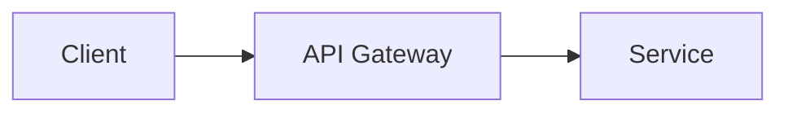
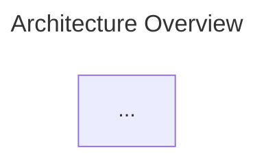
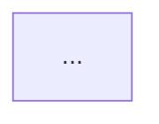

# Mermaid Diagram Export Skill

Render Mermaid diagrams in documents to PNG images using the mermaid-renderer tool.

**CRITICAL RULE:** Always render diagrams immediately after creating or editing Mermaid code. Never commit a document with unrendered Mermaid diagrams.

---

## Tool Location

```
~/.claude/tools/mermaid-renderer/
├── render-mermaid.js      # Single diagram renderer
└── process-document.js    # Full document processor
```

---

## Workflow

### Step 1: Create Document with Mermaid Diagrams

When creating a document with Mermaid diagrams, use the standard mermaid skill to generate the diagram code:

```markdown
# My Document

Here's the architecture:



More content...
```

### Step 2: Export Diagrams to SVG

After creating/editing a document with Mermaid blocks, run:

```bash
node ~/.claude/tools/mermaid-renderer/process-document.js <document-path> --verbose
```

**Options:**
- `--theme=<theme>` - Mermaid theme: `default`, `forest`, `dark`, `neutral`
- `--verbose` - Show detailed progress
- `--dry-run` - Preview without making changes

### Step 3: Result Structure

The tool will:
1. **Extract** all `\`\`\`mermaid` code blocks
2. **Render** each to SVG in `diagrams/{document-name}/`
3. **Replace** the code block with an image reference
4. **Preserve** original code in a comment for future editing

**Output structure:**
```
document.md
diagrams/
└── document/
    ├── diagram-1.svg
    ├── diagram-2.svg
    └── architecture-diagram.svg
```

**Document transformation:**

```markdown
<!-- Before -->
` ``mermaid
flowchart LR
    A --> B
` ``

<!-- After -->


<details>
<summary>Mermaid Source</summary>

` ``mermaid
flowchart LR
    A --> B
` ``

</details>
```

**IMPORTANT**: Use a collapsible `<details>` block (not HTML comments) to preserve the source. This keeps the document clean while making the source visible and editable.

---

## Rendering Single Diagrams

To render a single diagram without processing a full document:

```bash
# From a .mmd file
node ~/.claude/tools/mermaid-renderer/render-mermaid.js diagram.mmd output.svg

# From stdin
echo "flowchart TD; A-->B" | node ~/.claude/tools/mermaid-renderer/render-mermaid.js --stdin output.svg

# With theme
node ~/.claude/tools/mermaid-renderer/render-mermaid.js diagram.mmd output.svg --theme=dark
```

---

## Supported Document Types

| Extension | Image Syntax Used |
|-----------|-------------------|
| `.md`, `.markdown` | `` with HTML comment |
| `.html`, `.htm` | `` tag with HTML comment |
| `.mdx` | JSX `` with JSX comment |
| `.rst` | `.. image::` directive |
| `.adoc` | `image::` macro |

---

## Integration with Mermaid Skill

This skill works together with the main Mermaid diagram skill:

1. **Design**: Use the mermaid skill to design diagrams with proper styling
2. **Export**: Use this skill to render diagrams to PNG

**MANDATORY workflow:**

1. Create/edit mermaid code blocks in document
2. Run the export tool immediately (before any commit)
3. Commit document AND generated PNGs together

**DO NOT** commit a document containing unrendered mermaid blocks. The render step is not optional.

---

## Diagram Naming

Diagrams are named based on:
1. **Title** in diagram config (if present)
2. **First node name** in the diagram
3. **Fallback**: `diagram-1`, `diagram-2`, etc.

To control naming, add a title:

→ Generates `architecture-overview.svg`

---

## Editing Rendered Diagrams

To edit a previously rendered diagram:
1. Expand the `<details>` block to view the mermaid source
2. Edit the mermaid code directly inside the `<details>` block
3. Re-run the export tool
4. The image file is updated in place (document structure unchanged)

The tool automatically detects the rendered pattern (`` + `<details>` with mermaid source) and re-renders the images without modifying the document structure.

---

## ELK Layout Support

This renderer fully supports ELK layout for complex diagrams:



---

## How Re-rendering Works

The tool handles two scenarios:

### 1. Re-rendering Existing Diagrams

When it finds the rendered pattern:
```markdown


<details>
<summary>Mermaid Source</summary>

` ``mermaid
flowchart LR
    A --> B
` ``

</details>
```

The tool:
- Extracts the mermaid code from inside `<details>`
- Re-renders the image file in place
- **Does NOT modify the document** (no nesting issues)

### 2. Initial Rendering of New Diagrams

When it finds a standalone mermaid block (not inside `<details>`):
```markdown
` ``mermaid
flowchart LR
    A --> B
` ``
```

The tool:
- Renders to a new image file
- Wraps the block with image reference + `<details>` structure

---

## Troubleshooting

### "Could not find Chrome"
Puppeteer needs Chromium. Install globally: `npm install -g puppeteer`

### Diagram doesn't render

- Check Mermaid syntax at https://mermaid.live
- Ensure valid ELK config if using `layout: elk`

### SVG too large/small
The tool auto-sizes based on diagram content. For custom sizing, use the `` tag with width/height attributes (see Image Sizing section below).

---

## Image Sizing

**CRITICAL**: When resizing images in markdown, you MUST use the `` tag with size attributes. NEVER use CSS.

### Correct Way (Use This)

```markdown

```

Or with fixed pixel width:

```markdown

```

### Wrong Way (Never Do This)

```markdown
<!-- WRONG: CSS styling -->
{: style="width: 90%" }

<!-- WRONG: Kramdown attributes -->
{: width="90%" }
```

### Size Guidelines

| Diagram Type | Recommended Width |
|--------------|-------------------|
| Simple flowcharts | `width="70%"` |
| Complex architectures | `width="90%"` |
| Sequence diagrams | `width="80%"` |
| State machines | `width="60%"` |
| ER diagrams | `width="85%"` |

### With Details Block

When including the mermaid source in a details block:

```markdown


<details>
<summary>Mermaid Source</summary>

` ``mermaid
flowchart LR
    A --> B
` ``

</details>
```

### Diagrams not being re-rendered
Ensure the document has the correct pattern: `` followed by `<details>` with `<summary>Mermaid Source</summary>` and the mermaid code block. The pattern matching is strict to avoid false positives.

---

## Example Commands

```bash
# Process a markdown file
node ~/.claude/tools/mermaid-renderer/process-document.js ./docs/README.md --verbose

# Process with dark theme
node ~/.claude/tools/mermaid-renderer/process-document.js ./docs/arch.md --theme=dark

# Dry run to see what would happen
node ~/.claude/tools/mermaid-renderer/process-document.js ./docs/README.md --dry-run

# Render single diagram
node ~/.claude/tools/mermaid-renderer/render-mermaid.js ./diagrams/flow.mmd ./output/flow.svg
```
